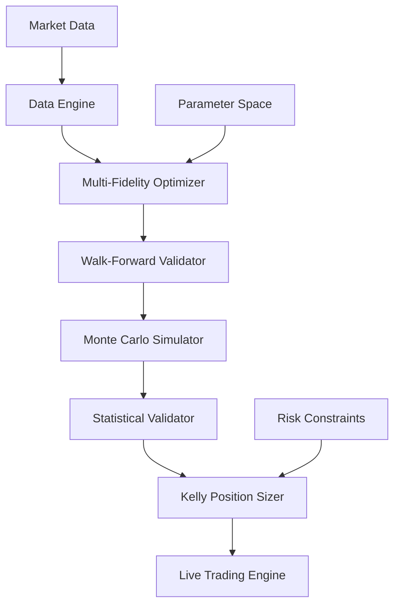
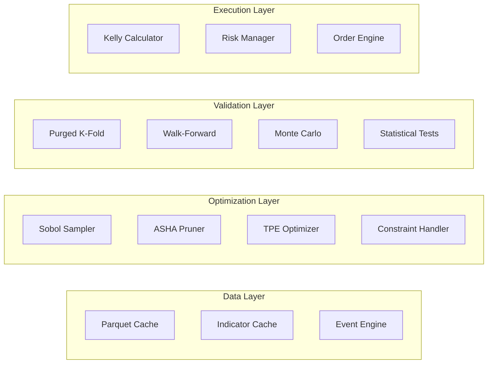

# Design Document

## Overview

이 설계는 기존의 느린 최적화 프로세스를 대체하는 고속 최적화 파이프라인을 구현합니다. 워크포워드 분석과 몬테카를로 시뮬레이션을 결합하여 업계 표준 기법들을 활용한 현실적으로 가장 빠르고 정확한 최적화를 제공합니다.

## Architecture

### High-Level Architecture



### Component Architecture



## Components and Interfaces

### 1. High-Speed Data Engine

**Purpose**: 최적화 속도를 극대화하기 위한 데이터 처리 엔진

**Key Features**:
- Parquet columnar storage with float32 downcasting
- Pre-computed indicators cached as ndarray
- Event-driven backtesting with incremental state updates
- Numpy vectorization + Numba JIT compilation

**Interface**:
```python
class DataEngine:
    def load_data(self, symbol: str, timeframe: str) -> pd.DataFrame
    def cache_indicators(self, df: pd.DataFrame) -> Dict[str, np.ndarray]
    def get_cached_slice(self, start: int, end: int) -> Dict[str, np.ndarray]
    def update_incremental(self, new_bar: Dict) -> None
```

### 2. Multi-Fidelity Optimization Engine

**Purpose**: 2단계 탐색 전략으로 효율적인 파라미터 최적화

**Stage 1 - Global Search (Low-Fidelity)**:
- Sobol/LHS 120점 샘플링
- Multi-fidelity: 10k→30k→50k data points
- ASHA early stopping (η=3): 70%→60% cut
- Screening: PF≥1.4 ∧ MinTrades≥80

**Stage 2 - Local Refinement (High-Fidelity)**:
- TPE/GP + EI 40 steps
- Full constraint validation
- Top-12 → Top-5 selection

**Interface**:
```python
class OptimizationEngine:
    def global_search(self, param_space: Dict, n_samples: int) -> List[Dict]
    def local_refinement(self, candidates: List[Dict]) -> List[Dict]
    def evaluate_candidate(self, params: Dict, fidelity: int) -> float
```

### 3. Walk-Forward Validator

**Purpose**: 실전과 동일한 조건에서 OOS 성능 검증

**Configuration**:
- Train 9개월 / Test 2개월
- 8 슬라이스 롤링
- Regime-aware slicing for volatility regimes

**Process**:
1. Each slice: Train_i → optimize → Test_i (OOS)
2. OOS aggregation: median + IQR
3. Pass criteria: PF_OOS≥1.8, Sortino_OOS≥1.5, etc.

**Interface**:
```python
class WalkForwardValidator:
    def create_slices(self, df: pd.DataFrame) -> List[Tuple[int, int]]
    def validate_slice(self, params: Dict, train_slice: Tuple, test_slice: Tuple) -> Dict
    def aggregate_results(self, slice_results: List[Dict]) -> Dict
```

### 4. Monte Carlo Simulator

**Purpose**: 견고성과 민감도 검증을 통한 리스크 평가

**Bootstrap Methods**:
- Block Bootstrap: block_length = ACF half-life
- Trade Resampling: preserve win/loss structure
- Execution Noise: slippage ±σ, spread events
- Parameter Perturbation: ±10% around optimal

**Interface**:
```python
class MonteCarloSimulator:
    def block_bootstrap(self, returns: np.ndarray, block_size: int) -> np.ndarray
    def resample_trades(self, trades: List[Dict]) -> List[Dict]
    def add_execution_noise(self, trades: List[Dict]) -> List[Dict]
    def run_simulation(self, params: Dict, n_sims: int) -> Dict
```

### 5. Statistical Validator

**Purpose**: 다중가설 보정과 통계적 유의성 검증

**Methods**:
- Deflated Sortino (Bailey) for multiple testing
- White's Reality Check / SPA test
- Final selection: 0.6×(MC p5) + 0.4×(WFO-OOS median)

**Interface**:
```python
class StatisticalValidator:
    def deflated_sortino(self, results: List[float], n_tests: int) -> float
    def whites_reality_check(self, benchmark: float, results: List[float]) -> float
    def spa_test(self, returns: np.ndarray) -> Dict
```

### 6. Kelly Position Sizer

**Purpose**: 켈리 0.5 기준의 안전한 포지션 사이징

**Logic**:
- Balance < 1000 USDT: 20 USDT minimum
- Balance ≥ 1000 USDT: Kelly 0.5 calculation
- DD scaling: 10% DD → 20% bet reduction
- Safety limits: max 5% account risk per trade

**Interface**:
```python
class KellyPositionSizer:
    def calculate_kelly(self, win_rate: float, avg_win: float, avg_loss: float) -> float
    def calculate_position_size(self, balance: float, kelly_fraction: float) -> float
    def apply_dd_scaling(self, position_size: float, current_dd: float) -> float
```

## Data Models

### OptimizationResult
```python
@dataclass
class OptimizationResult:
    parameters: Dict[str, float]
    score: float
    metrics: Dict[str, float]
    stage: str
    timestamp: datetime
    validation_passed: bool
```

### WalkForwardSlice
```python
@dataclass
class WalkForwardSlice:
    train_start: int
    train_end: int
    test_start: int
    test_end: int
    oos_metrics: Dict[str, float]
    profitable: bool
```

### MonteCarloResult
```python
@dataclass
class MonteCarloResult:
    percentiles: Dict[str, float]  # p5, p25, p50, p75, p95
    stability_metrics: Dict[str, float]
    robustness_score: float
    passed_criteria: bool
```

### PositionInfo
```python
@dataclass
class PositionInfo:
    size: float
    kelly_fraction: float
    risk_amount: float
    max_loss: float
    confidence_level: float
```

## Error Handling

### Optimization Failures
- **Data Issues**: Fallback to cached data, retry with reduced fidelity
- **Convergence Issues**: Switch to grid search, expand parameter bounds
- **Memory Issues**: Reduce batch size, implement data streaming

### Validation Failures
- **Insufficient OOS Data**: Extend data collection, reduce slice size
- **Statistical Failures**: Lower confidence thresholds, increase simulation count
- **Performance Degradation**: Revert to previous parameters, trigger re-optimization

### Runtime Errors
- **API Failures**: Implement exponential backoff, circuit breaker pattern
- **Network Issues**: Local caching, offline mode capability
- **System Resource**: Dynamic resource allocation, graceful degradation

## Testing Strategy

### Unit Tests
- Data engine components (caching, vectorization)
- Optimization algorithms (TPE, ASHA)
- Statistical functions (bootstrap, hypothesis tests)
- Position sizing calculations

### Integration Tests
- End-to-end optimization pipeline
- Walk-forward validation workflow
- Monte Carlo simulation chain
- Kelly position sizing integration

### Performance Tests
- Optimization speed benchmarks
- Memory usage profiling
- Concurrent execution testing
- Large dataset handling

### Validation Tests
- Historical backtest comparison
- Known parameter recovery tests
- Statistical test validation
- Risk management verification

## Performance Optimizations

### Computational Optimizations
- Numba JIT compilation for hot paths
- Numpy vectorization for array operations
- Parallel processing with Ray/Joblib
- Memory-mapped file access for large datasets

### Caching Strategy
- Multi-level caching (L1: memory, L2: SSD)
- Indicator pre-computation and storage
- Parameter space memoization
- Result caching with TTL

### Resource Management
- Dynamic batch sizing based on available memory
- CPU core allocation (70% of available)
- Memory usage monitoring and cleanup
- Disk space management for cache files

### Algorithmic Optimizations
- Early stopping with ASHA pruning
- Adaptive parameter bounds
- Smart initialization from previous results
- Incremental learning from historical optimizations